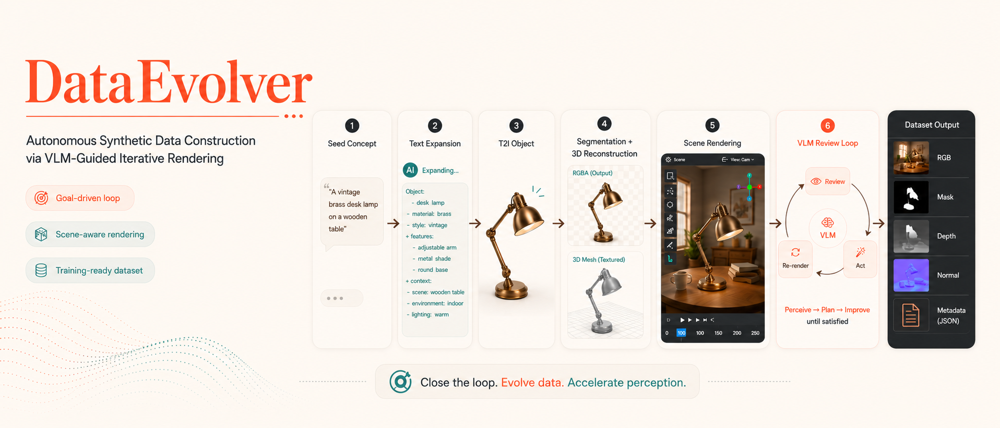
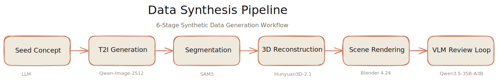
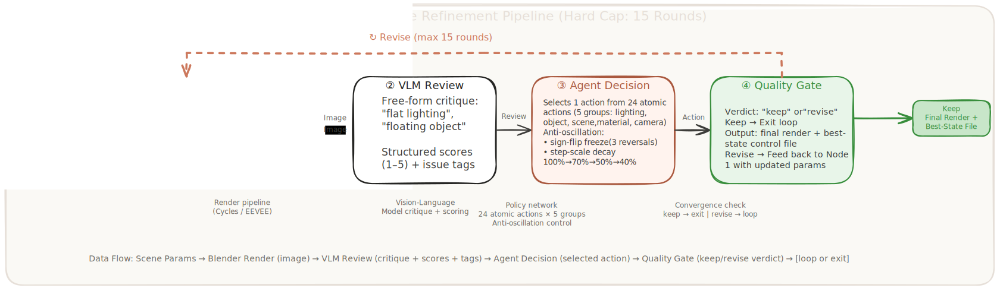
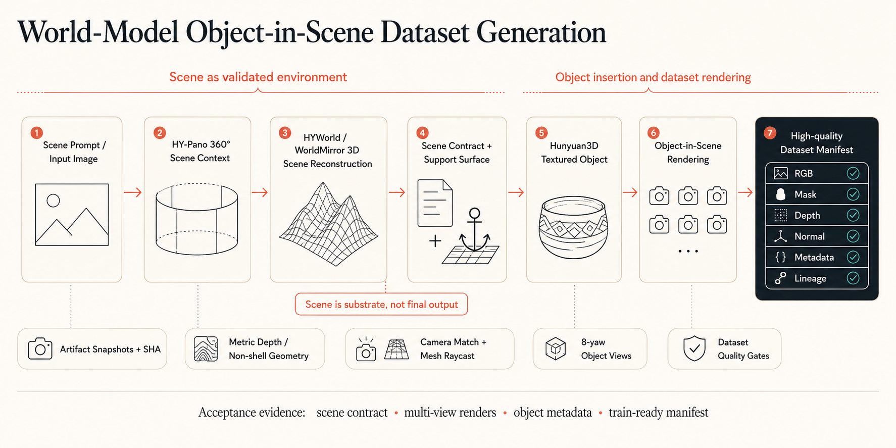

<p align="center">
  
</p>

<h1 align="center">DataEvolver</h1>

<p align="center">
  <strong>Autonomous Synthetic Data Construction via VLM-Guided Iterative Rendering</strong><br/>
  Build photorealistic, scene-aware training data with a closed loop of 3D rendering, VLM review, and targeted parameter repair.
</p>

<p align="center">
  <a href="https://arxiv.org/abs/2605.01789"></a>
  <a href="https://pris-cv.github.io/DataEvolver/"></a>
  <a href="LICENSE"></a>
  
  
</p>

<p align="center">
  <a href="README_zh.md">🇨🇳 中文</a> •
  <a href="https://pris-cv.github.io/DataEvolver/">🌐 Website</a> •
  <a href="https://arxiv.org/abs/2605.01789">📄 Paper</a> •
  <a href="#honors--recognition">🏆 Recognition</a> •
  <a href="#dataevolver-rotate">🧩 Dataset: DataEvolver-Rotate</a>
</p>

<p align="center">
  <strong>🧠 VLM free-form feedback</strong> •
  <strong>🎬 3D render-review-fix loop</strong> •
  <strong>📦 Training-ready multimodal data</strong>
</p>

---

## Why DataEvolver?

DataEvolver turns synthetic data construction into a **goal-driven optimization loop**: a VLM reviews rendered scenes in natural language, an agent diagnoses concrete rendering issues, and the scene is re-rendered with targeted parameter updates until the result is worth keeping.

- **Perceive beyond rigid scores** — free-form VLM feedback catches scene context, object placement, lighting, and material issues that fixed rules miss.
- **Repair with structured actions** — 24 bounded atomic actions adjust lighting, object pose, scene environment, and material appearance without uncontrolled drift.
- **Export training-ready data** — RGB, masks, depth, normals, geometry metadata, and object-disjoint splits are produced for downstream model training.

## Key Features

- **Goal-Driven Loop Agents** — VLM reviewer provides semantic feedback ("flat lighting", "floating object") &rarr; AI agent selects targeted actions &rarr; re-render &rarr; repeat until quality goals are met
- **24 Atomic Actions** — Structured action space across 5 groups: lighting, object placement, scene environment, and material properties — with anti-oscillation control and step-scale scheduling
- **Scene-Aware Rendering** — Objects placed in real Blender scenes with HDRI environments, raycast ground detection, and preserved scene lighting
- **Multi-Modal Output** — RGB, mask, depth, normal maps, and geometry metadata
- **End-to-End Automation** — From natural language seed concept to training-ready dataset, zero human intervention

---

## Pipeline Overview



| Stage | What it does | Model / Tool |
|-------|-------------|-------------|
| **1. Text Expansion** | LLM expands seed concept into detailed T2I prompt | Claude API (Anthropic) |
| **2. T2I Generation** | Generate 1024&times;1024 object image | Qwen-Image-2512 |
| **2.5. Segmentation** | Extract RGBA foreground, remove background | SAM3 |
| **3. 3D Reconstruction** | Reconstruct textured mesh from single image | Hunyuan3D-2.1 |
| **4. Scene Rendering** | Scene-aware Blender insertion with configurable EEVEE/Cycles rendering | Blender 4.2+ |
| **5. VLM Review Loop** | Free-form review &rarr; agent action &rarr; re-render until *keep* | Qwen3.5-35B-A3B |

### The VLM Review Loop (Stage 5)

The core innovation: a **goal-driven loop agent** that iteratively improves rendering quality.



**Anti-oscillation control** prevents parameter thrashing:
- Sign-flip tracking: freeze a parameter after 3 direction reversals
- Step-scale scheduling: Round 0 → 100%, Round 1 → 70%, Round 2 → 50%, Round 3+ → 40%
- Score-adaptive boost: &times;1.2 when hybrid_score < 0.65

---

## Prerequisites

- **OS**: Linux (tested on Ubuntu 20.04+)
- **GPU**: NVIDIA GPU with &ge;24 GB VRAM for rendering; &ge;80 GB for VLM inference
- **Python**: 3.10+
- **Blender**: 4.2+
- **CUDA**: Compatible with your PyTorch version

### Required Models

| Model | Purpose | Approx. Size |
|-------|---------|-------------|
| [Qwen-Image-2512](https://huggingface.co/Qwen/Qwen-Image-2512) | T2I generation | ~56 GB |
| [SAM3](https://github.com/facebookresearch/sam3) | Foreground segmentation | ~2 GB |
| [Hunyuan3D-2.1](https://github.com/Tencent-Hunyuan/Hunyuan3D-2.1) | Image-to-3D reconstruction | ~20 GB |
| [Qwen3.5-35B-A3B](https://huggingface.co/Qwen/Qwen3.5-35B-A3B) | VLM quality reviewer | ~35 GB |
| [Blender 4.2+](https://www.blender.org/download/) | 3D rendering engine | ~300 MB |

---

## Quick Start

Start with the lightweight onboarding dry-run. It checks the shape of your
environment, prints the setup and model download plan, and writes local
non-sensitive config files. It does **not** install dependencies, download model
weights, write tokens, or launch GPU jobs.

### 1. Clone the repository

```bash
git clone https://github.com/PRIS-CV/DataEvolver.git
cd DataEvolver
```

### 2. Install the package entry points

```bash
python -m pip install -e .
```

Use optional extras only for routes you actually plan to run, for example
`python -m pip install -e ".[hyworld]"` for HYWorld / WorldMirror setup.

### 3. Run the safe onboarding dry-run

For the fastest first pass, use the `quick` profile:

```bash
bash src/dataevolver/cli/bootstrap_dataevolver_default.sh \
  --profile quick \
  --dry-run \
  --write-local-config
```

For the default DataEvolver pipeline plan, choose a model root and run:

```bash
bash src/dataevolver/cli/bootstrap_dataevolver_default.sh \
  --profile default \
  --model-root /path/to/dataevolver-models \
  --workspace-root "$PWD" \
  --python-backend auto \
  --dry-run \
  --write-local-config
```

The script prints four sections:

| Section | What it tells you |
|---------|-------------------|
| `preflight` | Linux, GPU, Python, `uv`/`conda`, Blender, and Hugging Face CLI availability |
| `env plan` | The preferred `uv` environment plan and `conda` fallback |
| `model plan` | Hugging Face repos, target paths, gated-access notes, and printed download commands |
| `config plan` | Non-sensitive environment variables that the pipeline can read |

Available profiles:

| Profile | Use it when |
|---------|-------------|
| `quick` | You only want environment discovery and a dry-run route |
| `default` | You want the current core pipeline plan: Qwen-Image-2512, SAM3, Hunyuan3D-2.1, DINOv2 Giant, Qwen3.5-35B-A3B, and Blender |
| `full` | You also want the default Edit/T2V plan: Qwen-Image-Edit-2511 and Wan2.1-T2V |
| `world_model` | You want the optional HYWorld / WorldMirror scene reconstruction plan |
| `custom` | You already have replacement models and want them recorded for later compatibility review |

When `--write-local-config` is used, the generated local files are:

- `.dataevolver/local/ENVIRONMENT.md` — human-readable setup summary
- `.dataevolver/local/env.config.json` — structured config for agents and scripts
- `.dataevolver/local/env.sh.example` — sourceable non-sensitive path variables

`.dataevolver/local/` is ignored by Git. Do not put Hugging Face, Anthropic,
OpenAI, SSH, cookie, or API tokens in these files.

If you are working with an agent environment that supports skills, ask it to use
the `dataevolver-onboarding` skill. It should interview you for only five setup
areas: target route, runtime location, install policy, model strategy, and
workspace/output paths, then run the dry-run script above.

### 4. Production Setup

Create the runtime environment. On shared GPU servers, prefer
`--system-site-packages` so an already validated NVIDIA PyTorch build can be
reused. Install the CUDA wheel only if `import torch` fails inside the venv or
reports no usable CUDA.

```bash
uv venv .venv --python 3.10 --system-site-packages
source .venv/bin/activate

python - <<'PY'
import torch
print(torch.__version__, torch.cuda.is_available())
PY

# Fallback only when the torch check above fails.
uv pip install torch torchvision --index-url https://download.pytorch.org/whl/cu121

uv pip install \
  "numpy<2" "tokenizers==0.22.1" \
  diffsynth transformers accelerate diffusers safetensors \
  pillow opencv-python scipy scikit-image imageio trimesh \
  rembg[gpu] anthropic qwen-vl-utils lpips basicsr realesrgan \
  iopath timm ftfy \
  opentelemetry-api opentelemetry-sdk opentelemetry-exporter-otlp-proto-http
```

Review `.dataevolver/local/env.sh.example`, copy it to a machine-local file,
then source it before every real run:

```bash
cp .dataevolver/local/env.sh.example .dataevolver/local/env.remote.sh
# Edit paths only. Do not put tokens in this file.
source .dataevolver/local/env.remote.sh
source .venv/bin/activate
```

Production deployments should use environment variables instead of editing
pipeline scripts:

| Variable | Points to |
|----------|-----------|
| `DATAEVOLVER_WORKSPACE_ROOT` | DataEvolver checkout |
| `QWEN_IMAGE_MODEL_PATH` | Qwen-Image-2512 weights |
| `QWEN_IMAGE_EDIT_MODEL_PATH` | Qwen-Image-Edit-2511 weights, optional for edit routes |
| `SAM3_CKPT` | `sam3.pt` checkpoint |
| `SAM3_DIR` | SAM3 source checkout or importable package path |
| `HUNYUAN3D_REPO` | Tencent-Hunyuan/Hunyuan3D-2.1 source checkout |
| `MODEL_HUB` | Hunyuan3D-2.1 weights |
| `PAINT_MODEL_HUB` | Hunyuan3D paint weights, usually the same as `MODEL_HUB` |
| `DINO_MODEL_PATH` | DINOv2 Giant checkpoint directory |
| `REALESRGAN_CKPT` | `RealESRGAN_x4plus.pth` used by Hunyuan paint |
| `VLM_MODEL_PATH` | Qwen3.5-35B-A3B, or a verified compatible Qwen3.x replacement |
| `BLENDER_BIN` | Blender executable |

Keep source checkouts and model weights separate. `SAM3_CKPT` is the checkpoint
file, while `SAM3_DIR` is the SAM3 code path. `HUNYUAN3D_REPO` is the
Hunyuan3D source checkout, while `MODEL_HUB` and `PAINT_MODEL_HUB` are weight
directories.

#### Optional HYWorld / WorldMirror Scene Reconstruction

Use `--profile world_model` only when the target route is HYWorld / WorldMirror scene reconstruction. This keeps world-model setup out of the default core pipeline:

```bash
bash src/dataevolver/cli/bootstrap_dataevolver_default.sh \
  --profile world_model \
  --model-root /path/to/dataevolver-models \
  --workspace-root "$PWD" \
  --python-backend auto \
  --dry-run \
  --write-local-config
```

The world-model profile adds these local environment variables:

| Variable | Points to |
|----------|-----------|
| `HYWORLD_SRC` | HY-World-2.0 source checkout |
| `HYWORLD_WEIGHTS` | HY-World-2.0 weights, including `HY-WorldMirror-2.0` |
| `HYWORLD_PYTHON` | Python environment used for HYWorld dependencies |
| `HYWORLD_MOGE_MODEL_PATH` | Local MoGe model used for real panorama depth |
| `HYWORLD_ZIM_MODEL_PATH` | Local ZIM model used for sky masking |
| `HYWORLD_GROUNDING_DINO_MODEL_PATH` | Local GroundingDINO model used by HYWorld navigation |
| `HYWORLD_SAM3_MODEL_PATH` | Local SAM3 model/source path used by HYWorld |
| `HYWORLD_WORLDSTEREO_PATH` | Local WorldStereo weights root |
| `HYWORLD_WAN_BASE_MODEL` | Local Wan I2V base Diffusers model used by WorldStereo/video generation |

HYWorld production scene generation requires local MoGe, ZIM, GroundingDINO, SAM3, WorldStereo, Wan I2V base, and HY-WorldMirror weights. Offline mode forbids downloads but must still load these local models; do not set `HYWORLD_NO_MODEL_DOWNLOADS=1` for real 3D scene generation because that skips metric depth and can produce a fixed-radius panorama shell.

`python -m dataevolver.workflows.hyworld.scene_pano` and `python -m dataevolver.workflows.hyworld.full_worldgen` preserve changed stage artifacts under `<scene-dir>/intermediates/<run-id>/` by default. The HY-Pano stage snapshots the 360-degree equirectangular panorama, and full worldgen snapshots the input again under `00_source_panorama/` before retaining trajectory, depth/sky-mask, WorldStereo, GS, and WorldMirror outputs.

##### Automated Scene Construction

The world-model route can build a reviewable scene package automatically from scene prompts or an input scene image. The pipeline first generates a 360-degree HY-Pano context, runs HYWorld / WorldMirror reconstruction, converts metric geometry into a Blender scene contract, renders pure-scene multi-view evidence, and then inserts objects with fixed scene-camera alignment. The final report records contract checks, per-view scene renders, object rotation views, masks, depth, normals, metadata gates, and lineage hashes.



```bash
python -m dataevolver.cli.production doctor \
  --profile .dataevolver/local/production_profile.json \
  --no-imports

python -m dataevolver.workflows.hyworld.scene_pano \
  --scene-prompts-path <scene-prompts.json> \
  --output-root <hyworld-scene-root>

python -m dataevolver.workflows.hyworld.full_worldgen \
  --profile .dataevolver/local/production_profile.json \
  --scene-dir <hyworld-scene-root>/<scene-id> \
  --intermediate-root <intermediate-root>/<scene-id>

python -m dataevolver.workflows.hyworld.finalize_object_scene_report \
  --dataset-base <dataset-base> \
  --strict-scene-views
```

HYWorld / WorldMirror follows the staged world-generation route HY-Pano -> WorldNav -> WorldStereo -> WorldMirror/3DGS. Do not treat a VLM pass as authoritative for world-model completion; use contract-backed geometry, multi-view pure-scene renders, and final manifest/lineage evidence.

After CUDA and `nvcc` are confirmed, build Hunyuan3D's native extensions:

```bash
uv pip install --no-build-isolation -e "$HUNYUAN3D_REPO/hy3dpaint/custom_rasterizer"
cd "$HUNYUAN3D_REPO/hy3dpaint/DifferentiableRenderer"
bash compile_mesh_painter.sh
```

### 5. Production Smoke Tests

Run preflight and import checks first:

```bash
python3 --version
uv --version
nvidia-smi
df -h .
"$BLENDER_BIN" --version

python - <<'PY'
import torch
print("cuda:", torch.cuda.is_available(), "bf16:", torch.cuda.is_bf16_supported())
from transformers import AutoProcessor
from opentelemetry import trace
PY
```

Then validate one object through the runtime stages:

```bash
SMOKE_ROOT=.dataevolver/local/smoke

python -m dataevolver.workflows.stages.t2i_generate --ids obj_001 --steps 1 --height 512 --width 512 --device cuda:0
python -m dataevolver.workflows.stages.sam_segment --ids obj_001 --device cuda:0
python -m dataevolver.workflows.stages.image_to_3d --ids obj_001 --shape-only --device cuda:0 --output-dir "$SMOKE_ROOT/meshes_shape_only"

python -m dataevolver.workflows.stages.image_to_3d \
  --no-skip \
  --ids obj_001 \
  --device cuda:0 \
  --output-dir "$SMOKE_ROOT/meshes_textured" \
  --paint-max-faces 5000 \
  --paint-remesh-modes false \
  --paint-attempt-timeout-sec 300
```

`--shape-only` is a fallback for missing DINO, RealESRGAN, or paint extensions;
it is not a complete textured production-readiness check. Also run the Stage
5.5 VLM loader smoke before starting a full review loop.

After the deployment evidence has been recorded, remove generated smoke
artifacts so the working directory stays clean:

```bash
rm -rf .dataevolver/local/smoke
```

Only after these checks pass should you prepare scene assets and run
`bash src/dataevolver/cli/run_all.sh`. Scene-aware review and action application
use `python -m dataevolver.annotation.vlm_review_stage` and
`python -m dataevolver.agents.feedback_apply` after model paths, `BLENDER_BIN`,
and `configs/scene_template.json` are configured.

---

## Reproducible Research Prior Workflow

The public repository keeps the lightweight WebSearch prior entry point and the
universal 3D layout schema, but does not publish the old local Blender batch
scripts, private scene pools, generated meshes, `.blend` scene files, model
weights, API keys, or paper source.

Core entry points:

- Stage0 WebSearch prior: [`python -m dataevolver.tools.stage0_web_research`](python -m dataevolver.tools.stage0_web_research)
- Universal dataset schema: [`configs/schemas/universal_3d_layout_dataset_schema.json`](configs/schemas/universal_3d_layout_dataset_schema.json)

Start a WebSearch prior session:

```bash
python -m dataevolver.tools.stage0_web_research init \
  --query "SeeThrough3D: Occlusion Aware 3D Control in Text-to-Image Generation" \
  --output-dir .dataevolver/runtime/research_priors/demo_universal \
  --dataset-mode universal \
  --tag universal-3d-layout
```

---

## Project Structure

```
DataEvolver/
├── src/dataevolver/
│   ├── agents/                              # Feedback/action application
│   ├── annotation/                          # VLM and constraint review
│   ├── cli/                                 # Public onboarding and runtime entry points
│   ├── dataset/                             # Dataset loaders and metadata exporters
│   ├── runtime/                             # Runtime profiles, asset lifecycle, HYWorld contracts
│   ├── testing/                             # Public smoke and contract tests
│   ├── tools/                               # Research prior and diagnostics helpers
│   └── workflows/
│       ├── hyworld/                         # Optional HYWorld bridge modules
│       ├── multimodal/                      # T2I/Edit/T2V dataset workflow
│       └── stages/                          # Core stage modules
├── configs/
│   ├── action_space.json                    # Core action-space contract
│   ├── scene_action_space.json              # 24 atomic actions definition
│   ├── scene_template.json                  # Blender scene template config
│   ├── production_profile.example.json      # Example production profile
│   ├── vlm_review_schema.json               # VLM review output schema
│   └── dataset_profiles/                    # Public example profiles
├── .agents/                                 # Agent skills and setup guidance
├── .github/                                 # GitHub workflows and repo metadata
├── assets/
│   ├── hdri/                                # HDRI environment maps
│   └── scene/                               # Blender scene files (.blend)
└── web/                                     # Project website (GitHub Pages)
```

---

## Action Space

The AI agent selects from **24 structured atomic actions** organized in 5 groups:

| Group | Actions | Parameters |
|-------|---------|-----------|
| **Lighting** (4) | Key light intensity &uarr;&darr;, key light yaw &plusmn;15&deg; | Multiplicative &times;1.2/&times;0.8 or additive, bounded |
| **Object** (6) | Elevation &plusmn;0.02, yaw &plusmn;15&deg;, scale &times;1.1/&times;0.9 | Bounded within safe ranges |
| **Scene** (5) | Env rotation &plusmn;30&deg;, env intensity &uarr;&darr;, contact shadow | HDRI and environment controls |
| **Material** (9) | Saturation, value/brightness, hue offset, roughness, specular/sheen | Fine-grained material tuning |
| **Camera** (0) | Reserved for future use | — |

Full action definitions: [`configs/scene_action_space.json`](configs/scene_action_space.json)

---

## DataEvolver-Rotate

The first benchmark dataset produced by DataEvolver — for rotation-conditioned image editing.

| Metric | Value |
|--------|-------|
| Unique Objects | 50 |
| Rotation Angles | 8 (0&deg;, 45&deg;, 90&deg;, 135&deg;, 180&deg;, 225&deg;, 270&deg;, 315&deg;) |
| Training Pairs | 350 (front &rarr; 7 target views) |
| Train / Val / Test | 245 / 49 / 56 pairs (object-disjoint, seed=42) |
| Modalities | RGB, mask, depth, normal |

### Methodology

Each object uses a single **canonical yaw-0&deg; best state** as the base. The object is then rotated while the scene, camera, lighting, and material remain fixed — ensuring cross-angle consistency.

### Loading the Dataset

```python
import json
from pathlib import Path
from PIL import Image

root = Path("path/to/dataset_split")
rows = []
with (root / "pairs" / "train_pairs.jsonl").open("r") as f:
    for line in f:
        rows.append(json.loads(line))

row = rows[0]
source = Image.open(root / row["source_image"]).convert("RGB")
target = Image.open(root / row["target_image"]).convert("RGB")
instruction = row["instruction"]  # e.g., "Rotate the object 45 degrees clockwise"
```

---

## Using with Claude Code

DataEvolver is designed to work with [Claude Code](https://docs.anthropic.com/en/docs/claude-code) as an AI-powered development and operations assistant. Claude Code reads a project-level `CLAUDE.md` file to understand your environment, then helps you run pipelines, analyze results, and build datasets through natural language.

### Step 1: Install Claude Code

```bash
npm install -g @anthropic-ai/claude-code
```

### Step 2: Create your `CLAUDE.md`

Create a `CLAUDE.md` in the project root (it's gitignored — each user maintains their own). This file tells Claude Code about your specific environment:

```markdown
# CLAUDE.md

## Remote Server
- SSH alias: `my-server`
- GPU: 3x A800 80GB (or your setup)
- Python: `/path/to/python3` (3.10+, with PyTorch)
- Blender: `/path/to/blender` (4.2+)
- Code directory: `/path/to/DataEvolver`

## Model Paths
- Qwen-Image-2512: `/path/to/Qwen-Image-2512`
- SAM3 checkpoint: `/path/to/sam3/sam3.pt`
- Hunyuan3D-2.1 repo: `/path/to/Hunyuan3D-2.1`
- Hunyuan3D-2.1 weights: `/path/to/model_hub/Hunyuan3D-2.1`
- Qwen3.5-35B-A3B: `/path/to/Qwen3.5-35B-A3B`

## Scene Config
- Blender scene file: `/path/to/scene.blend`
- HDRI directory: `/path/to/hdri/`
- Render engine: CYCLES, 512 samples, 1024x1024

## Key Configs
- Action space: `configs/scene_action_space.json` (24 atomic actions)
- Scene template: `configs/scene_template.json`
- Dataset profiles: `configs/dataset_profiles/`

## Pipeline
Stage 1 (Text Expansion) → Stage 2 (T2I) → Stage 2.5 (SAM3)
→ Stage 3 (3D Reconstruction) → Stage 4 (Blender Render) → Stage 5 (VLM Loop)

## Working Rules
- Always test on the remote server, not locally
- Use tmux for long-running tasks (screen not available on all servers)
- Read trace.json free-form text for VLM results — not just agg.json scores
- Only stop VLM loop when reviewer explicitly says "keep"
- Check GPU usage before launching new jobs
```

### Step 3: Create Claude Code Skills (Optional)

You can create reusable skills in a `skills/` directory for common workflows:

```bash
mkdir -p skills/scene-agent-loop
```

```markdown
# skills/scene-agent-loop/SKILL.md
---
name: scene-agent-loop
description: Manage the VLM review loop for scene rendering
---
# Scene Agent Loop
Monitor and continue the VLM review → render → agent decision loop.
Read trace.json to understand current state, then decide next action.
```

### Step 4: Launch Claude Code

```bash
cd DataEvolver
claude
```

Claude Code will read your `CLAUDE.md` and understand the full project context. Example commands:

```
> Check GPU usage on the server
> Run the full pipeline for 10 new furniture objects
> Export rotation8 dataset from the latest best states
> Build train-ready dataset with object-disjoint split
```

---

## Citation

```bibtex
@misc{zhang2026dataevolverletdatabuild,
  title={DataEvolver: Let Your Data Build and Improve Itself via Goal-Driven Loop Agents},
  author={Qisong Zhang and Wenzhuo Wu and Zhuangzhuang Jia and Yunhao Yang and Huayu Zhang and Xianghao Zang and Zhixiang He and Zhongjiang He and Kongming Liang and Zhanyu Ma},
  year={2026},
  eprint={2605.01789},
  archivePrefix={arXiv},
  primaryClass={cs.AI},
  url={https://arxiv.org/abs/2605.01789},
}
```

## Honors & Recognition

- 🏆 **[AIDataSci 2026, KDD 2026 Workshop](https://usail-hkust.github.io/aidatasci/)** — DataEvolver was accepted as an **Oral Presentation**. [View on OpenReview](https://openreview.net/forum?id=8ppusILCIH).
- 🎖️ **2026 BAAI Conference Agent for Science Competition** — DataEvolver received a **Certificate of Poster Presentation** and was selected for on-site poster presentation.

<p align="center">
  
</p>

## Roadmap

### Completed

- [x] **WebSearch-integrated AI Agent** — Stage0 WebSearch supports both single-paper reproduction and multi-paper universal dataset modes. It records paper evidence, exports handoff documents, and has been validated on the remote rendering environment.
- [x] **Multi-paper universal 3D dataset synthesis** — the workflow starts from an anchor paper, expands to related 3D-control papers, and extracts shared dataset requirements for target images, masks, OSCR/structure views, camera metadata, object layout, occlusion relations, scene graphs, and validation traces.
- [x] **Universal 3D layout dataset contract** — DataEvolver now tracks a reusable schema for Blender-backed target renders, per-object masks, structure views, depth-order proxies, orientation proxies, camera pose/intrinsics/viewpoint tokens, mesh metadata, 3D boxes, scene graphs, spatial relations, and promotion decisions.
- [x] **Blender-backed dual-object scenes** — the current universal 3D workflow can generate real-scene, dual-object records with DataEvolver scene and mesh assets. General N-object compositional scenes remain a separate extension.
- [x] **VLM/CV self-evolution loop** — selected universal 3D records can be reviewed with calibrated hybrid VLM and CV geometry scores, bounded repair actions, and explicit accept/reject promotion traces.
- [x] **Paper-specific and universal export modes** — the WebSearch and universal layout scripts support both single-paper dataset reproduction and multi-paper universal schema export.

### In Progress

- [ ] **Structured VLM knowledge base** — current scoring already uses structured VLM/CV criteria, mask coverage checks, depth-order proxy checks, geometry-review metadata, and a VGGT-Omega proxy hook. A persistent prior-knowledge store for reusable VLM assessment criteria is still under development.
- [ ] **Real-world dataset ingestion** — WebSearch can discover public datasets and paper resources, and public artifacts such as SeeThrough3D are used as references. A full crawl-clean-process-ingest pipeline for arbitrary real-world datasets is still pending.
- [ ] **Auto-generated reasoning-evaluation datasets** — current records include validation logs, hybrid scores, and promotion traces. Fully automated benchmark generation after downstream model training remains a future release target.

### Pending

- [ ] **Video object datasets** — extend image-level rendering to temporally consistent object removal, translation, rotation, insertion, and attribute editing across frames.
- [ ] **Temporal review and filtering** — add sequence-level checks for flicker, trajectory smoothness, mask stability, depth continuity, and action consistency.
- [ ] **General N-object compositional scenes** — beyond the current dual-object workflow, this requires relation-aware sampling, collision handling, occlusion planning, and stronger multi-object VLM/CV review.
- [ ] **Large-scale public dataset ingestion** — scale WebSearch-discovered dataset ingestion into repeatable crawling, cleaning, licensing, provenance, and structured export workflows.

## License

[Apache-2.0](LICENSE)
